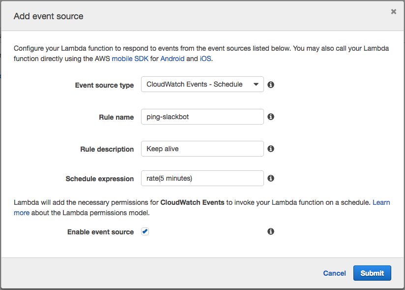

# lambda-slack-router

[](https://travis-ci.org/localytics/lambda-slack-router)
[](https://www.npmjs.com/package/lambda-slack-router)

`lambda-slack-router` is a pattern for building [Slack slash commands](https://api.slack.com/slash-commands) using the Amazon AWS Lambda service and Node.js. It functions as a single endpoint that receives a JSON payload from Slack and returns an appropriate response. For instance, if you were to enter

    /testbot ping

into a correctly configured Slack channel, it would call the appropriate `ping` command and return the generated response to the user. A `help` command is also generated that is based on the provided commands and their descriptions, so that you can also call

    /testbot help

and a usage message will be returned.

## Installation

This package is [hosted on npm](https://www.npmjs.com/package/lambda-slack-router). From the root of your project run:

    $ npm install --save lambda-slack-router

or if you're using `yarn`, run:

    $ yarn add lambda-slack-router

## Configuration

Commands are added to the slackbot through the `addCommand` function. Sample configuration for the above ping command would look like

```javascript
var SlackBot = require('lambda-slack-router');
var slackbot = new SlackBot({ token: "<token>" });
slackbot.addCommand('ping', 'Ping the lambda', function (options, callback) {
  callback(null, slackbot.inChannelResponse('Hello World'));
});
```

In the above code, a slackbot is created with the given token (used for verifying the authenticity of each request). The ping command is then added to the routing, and when called responds with an in-channel response of 'Hello World'.

The first argument to the `addCommand` function is the name of the command. The second argument is the description of the function. This is used in the generated `help` command, and is useful to your users when they can't remember the syntax of your bot.

The two arguments passed to the command callback are `options` and `callback`. The `options` object contains all of the properties that came from lambda, as well as the `args` property (the arguments passed to the function, as an object). The callback function is the same as the `context.done` function that's built into [lambda](http://docs.aws.amazon.com/lambda/latest/dg/nodejs-prog-model-context.html). The function expects that an error will be passed in as the left argument if there is one, and otherwise a successful execution's response will be passed in as the right argument.

The responses for Slack can either be ephemeral (returning to the user that invoked the function) or in-channel (returning to everyone in the channel in which the function was invoked). SlackBot has a built-in helper for each of these types of responses which are `ephemeralResponse` and `inChannelResponse` respectively. If you pass a string to either one of these functions they return a correctly-formatted object. If you want more fine-grained control, you can pass an object to them and they will set the `response_type` attribute. You can also ignore these functions entirely if you want to return a custom payload.

### Response Structure

By default, the SlackBot will respond with the exact structure that slack expects. This will function properly using [our scaffold](https://github.com/localytics/serverless-slackbot-scaffold) because of the request template that we constructed:

```json
"requestTemplates": {
  "application/x-www-form-urlencoded": "{\"body\" : $input.json(\"$\")}"
}
```

You can, however, set up your own function to build the structure of your responses by setting the `structureResponse` property of the configuration object that you pass to the SlackBot constructor. This example below will be sufficient to get API gateway working out of the box:

```javascript
var slackbot = new SlackBot({
  structureResponse: function (response) {
    return { body: JSON.stringify(response) };
  }
});
```

## Responding to Buttons with Actions

Before you can have `Buttons with Actions` you will need to setup a [SlackApp](https://api.slack.com/slack-apps). Note you do not need to publicly publish your SlackApp to utilize the Slack buttons. See the [slack documentation](https://api.slack.com/docs/message-buttons) for more information on buttons.

The action configured must match the `name` value of the presented button.
There's no need to use inChannelResponse or ephemeralResponse since your provided message will replace the existing message when using the callback.

```javascript
slackbot.addAction('buttonPress', function (options, callback) {
  callback(null, { text: "You pressed a button" });
});
```

## Security

Slackbots can optionally be locked down with the token provided by slack. If provided, the token will be checked against each request. It is recommended to provide a token whenever possible, as the endpoint is otherwise vulnerable to exploitation. It is usually easiest to maintain the token in an environment variable, like so:

```javascript
var slackbot = new SlackBot({ token: process.env.SLACK_VERIFICATION_TOKEN });
```

## Cold Start

After uploading a new version of your lambda function or extended periods of inactivity, AWS spins down your lambda in order to conserve resources. This results in the lambda being in a "cold" state, and the next time it is accessed it must spin up again, resulting in a "cold start penalty." This can be especially problematic for slackbots, as the extra time needed to spin up the lambda can take longer than slack is willing to wait for a response. To mediate this, you can set `pingEnabled` to true in the slackbot config and set up a CloudWatch event that will ping your lambda every 5 minutes to keep it running hot. Below is an example of the necessary configuration:

```javascript
var slackbot = new SlackBot({ pingEnabled: true });
```



If you're using Serverless to configure your lambda project, you can add the following to your `s-function.json` file to configure the event source on function deploy:

```json
{
  "events": [
    {
      "name": "ping-slackbot",
      "type": "schedule",
      "config": {
        "schedule": "rate(5 minutes)",
        "enabled": true
      }
    }
  ]
}
```

## Arguments

Commands can optionally have arguments. When commands have arguments, the router will only invoke that command if the number of arguments matches. Arguments are specified as an array as the second argument to `addCommand`. As an example:

```javascript
slackbot.addCommand('testing', ['one', 'two'], 'Testing', function (options, callback) {
  callback(null, slackbot.ephemeralResponse('One: ' + options.args.one + ', Two: ' + options.args.two));
});
```

There are three types of arguments: required, optional, and splat. The two arguments in the above command are both required. To specify an optional command use an object with one key where the key is the name of the argument and the value is the optional value. To specify a splat argument (one that will be an array of indeterminant length) append an ellipsis to the end of the name. An example that uses all three is below:

```javascript
slackbot.addCommand('echo', ['title', { lastName: 'User' }, 'words...'], 'Respond to the user', function (options, callback) {
  var response = 'Hello ' + options.args.title + ' ' + options.args.lastName;
  if (option.args.words.length) {
    response += ', ' + options.args.words.join(' ');
  }
  callback(null, slackbot.ephemeralResponse(response));
});
```

## Routing

The routing for the commands is achieved by the Slackbot's router acting as the [handler function](http://docs.aws.amazon.com/lambda/latest/dg/nodejs-prog-model-han) for the lambda. After a Slackbot has been fully configured (adding in configuration, building the command callbacks, etc.), the handler should be set to the return value of the buildRouter function.

```javascript
exports.handler = slackbot.buildRouter();
```

## Testing

It's helpful in testing your function to also export the slackbot itself. If it's part of the module's exports, each function can be tested explicitly as opposed to having to go through the router (which would be testing library code instead of your own). A sample test using `mocha` and `chai` for the aforementioned `ping` function would look like

```javascript
var expect = require('chai').expect;
var slackbot = require('../slackbot/handler').slackbot;

describe('slackbot', function () {
  it('responds to ping', function () {
    var received = false, receivedArgs = [], callback = function (error, success) {
      received = true;
      receivedArgs = [error, success];
    };

    slackbot.ping(null, callback);
    expect(received).to.be.true;
    expect(receivedArgs).to.deep.eq([null, slackbot.inChannelResponse('Hello World')]);
  });
});
```

assuming your handler is named index.js and you had `exports.slackbot = slackbot` in your handler.
